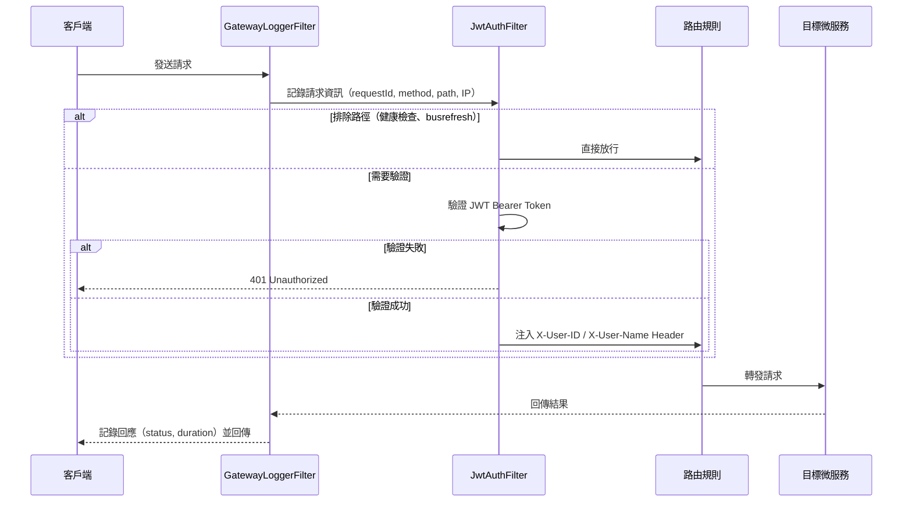
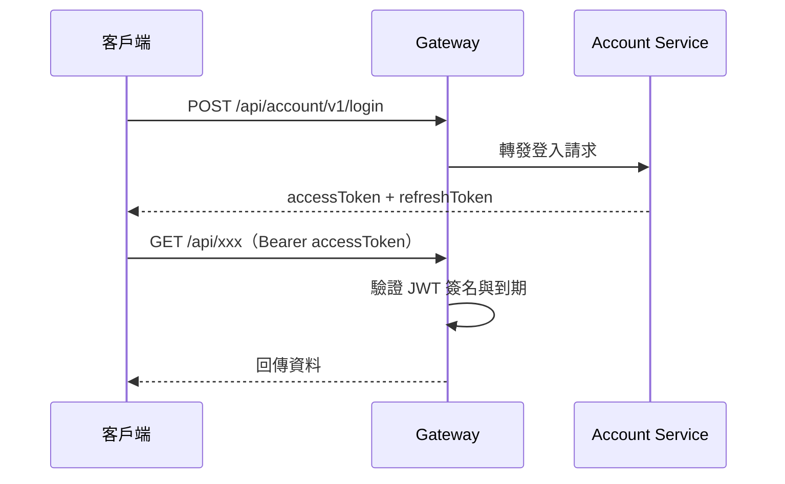

# Gateway Service


微服務生態系的統一入口，基於 Spring Cloud Gateway。透過 JWT 驗證保護所有 API，將請求路由至對應微服務，並透過 Spring Cloud Bus + RabbitMQ 支援動態配置刷新。

## 快速開始

### 前置需求

- Java 21
- Docker Desktop

### 使用 IntelliJ IDEA

1. `File` → `Open` → 選擇專案根目錄，等待 Gradle 同步完成
2. 點擊 `GatewayserviceApplication` 旁的 ▶ 啟動（local profile 所有設定皆有預設值，無需額外設定環境變數）
3. 開啟 http://localhost:8080/actuator/health 確認回傳 `{"status":"UP"}`

## 系統架構

### 請求處理流程

所有請求依序通過兩個 GlobalFilter，再由路由規則轉發至目標微服務：



### JWT 驗證流程

JWT 由下游 Account Service 負責簽發，Gateway 只負責驗證：



### 路由規則

請求路徑格式為 `/api/{服務名稱}/**`，Gateway 去掉前兩段後轉發：

| 路徑前綴            | 目標服務         | 說明   |
|-----------------|--------------|------|
| `/api/account/**` | accountservice | 帳號服務 |

## API 端點

Gateway 本身僅暴露 Actuator 端點：

| 端點                     | 方法   | 說明         | 認證              |
|------------------------|------|------------|-----------------|
| `/actuator/health`     | GET  | 健康檢查       | 不需要             |
| `/actuator/busrefresh` | POST | 觸發全域配置刷新   | HTTP Basic Auth |

`/actuator/busrefresh` 使用 `SECURITY_USERNAME` / `SECURITY_PASSWORD` 進行 HTTP Basic 認證。

## 環境變數

| 變數                       | 預設值     | 說明                           |
|--------------------------|---------|------------------------------|
| `SERVER_PORT`            | `8080`  | 服務埠號                         |
| `SERVER_HOST`            | -       | 實例對外主機位址（prod 用於 Eureka 自我註冊） |
| `SPRING_PROFILES_ACTIVE` | `local` | 啟動環境（local / prod）           |
| `SECURITY_USERNAME`      | `admin` | busrefresh HTTP Basic 帳號     |
| `SECURITY_PASSWORD`      | `password` | busrefresh HTTP Basic 密碼  |
| `JWT_SECRET`             | -       | JWT 驗證金鑰（至少 32 字元，prod 必填）  |
| `CONFIG_SERVER_URI`      | -       | Config Server 位址（prod）       |
| `CONFIG_SERVER_USERNAME` | -       | Config Server 帳號（prod）       |
| `CONFIG_SERVER_PASSWORD` | -       | Config Server 密碼（prod）       |
| `EUREKA_SERVER_HOST`     | -       | Eureka Server 主機位址（prod）     |
| `EUREKA_SERVER_PORT`     | `8761`  | Eureka Server 連接埠（prod）      |
| `RABBITMQ_HOST`          | -       | RabbitMQ 主機位址（prod）          |
| `RABBITMQ_PORT`          | `5672`  | RabbitMQ 連接埠（prod）           |
| `RABBITMQ_USERNAME`      | -       | RabbitMQ 帳號（prod）            |
| `RABBITMQ_PASSWORD`      | -       | RabbitMQ 密碼（prod）            |

`local` profile 不需要 Config Server、RabbitMQ、JWT_SECRET 連線，所有變數皆有預設值。

## 部署

以下指令在**部署目標主機**上執行，需已安裝 Docker 與 Docker Compose。Windows 和 Linux 流程一致。

### 部署目錄結構

將以下四個檔案放在同一個目錄下：

```
/opt/tata/gatewayservice/          # Linux 範例路徑（Windows 可自訂）
├── gatewayservice.jar             # 編譯產出
├── Dockerfile                     # 來源：docs/docker/Dockerfile
├── .dockerignore                  # 來源：docs/docker/.dockerignore
├── docker-compose.yml             # 來源：docs/docker/docker-compose.yml
└── .env                           # 來源：docs/docker/.env.example（填入實際值）
```

### 首次部署

1. 在專案開發機編譯 JAR：
   ```bash
   ./gradlew bootJar
   ```
2. 將 `build/libs/gatewayservice.jar`、`docs/docker/Dockerfile`、`docs/docker/.dockerignore`、`docs/docker/docker-compose.yml`、`docs/docker/.env.example` 複製到部署主機的同一目錄
3. 將 `.env.example` 改名為 `.env`，填入實際的設定值
4. 在該目錄下啟動：
   ```bash
   docker compose up -d
   ```

### 更新版本

1. 在開發機重新編譯 JAR
2. 將新的 `gatewayservice.jar` 複製到部署目錄，覆蓋舊檔
3. 重新建構並啟動：
   ```bash
   docker compose up -d --build
   ```

### 驗證

部署完成後確認服務狀態：

```bash
docker compose ps
curl http://localhost:8080/actuator/health
```

### 常用維運指令

| 指令                                       | 說明        |
|------------------------------------------|-----------|
| `docker compose logs -f gatewayservice`  | 即時查看日誌    |
| `docker compose restart gatewayservice`  | 重啟服務      |
| `docker compose down`                    | 停止並移除所有容器 |
| `docker compose build --no-cache`        | 重新建構映像    |

## 版本管理

本專案採用 [Semantic Versioning](https://semver.org/)，以 **Git Tag 作為唯一版本來源**。`build.gradle.kts` 建構時自動讀取最近的 Tag 作為版本號，無 Tag 則為 `0.0.1-SNAPSHOT`。

### 版號規則

| 版號位置  | 何時遞增         | 範例                  |
|-------|--------------|---------------------|
| MAJOR | 重大架構變更、技術棧升級 | `v1.0.0` → `v2.0.0` |
| MINOR | 新增功能、配置結構調整  | `v1.0.0` → `v1.1.0` |
| PATCH | Bug 修復、小幅調整  | `v1.0.0` → `v1.0.1` |

### 發版流程

```bash
./gradlew build                    # 1. 確認測試通過
git add <files>                    # 2. Commit 變更
git commit -m "[feat] 功能描述"
git tag v1.0.0                     # 3. 打 Tag 定版
git push && git push --tags        # 4. Push（觸發 GitHub Actions 自動部署）
```

### Commit 訊息格式

```
[類型] 中文描述
```

| 類型         | 說明        |
|------------|-----------|
| `feat`     | 新增功能      |
| `fix`      | 修復 Bug    |
| `refactor` | 重構（不影響功能） |
| `docs`     | 文件更新      |
| `test`     | 測試相關      |
| `config`   | 配置檔變更     |

## 參考資源

- [Spring Cloud Gateway 官方文件](https://docs.spring.io/spring-cloud-gateway/docs/current/reference/html/)
- [Spring Cloud Netflix Eureka 官方文件](https://docs.spring.io/spring-cloud-netflix/docs/current/reference/html/)
- [Spring Cloud Bus 官方文件](https://docs.spring.io/spring-cloud-bus/docs/current/reference/html/)
- [Spring Boot Actuator 官方文件](https://docs.spring.io/spring-boot/docs/current/reference/html/actuator.html)
